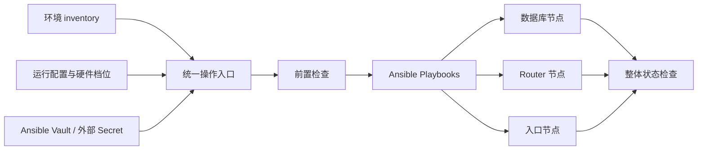
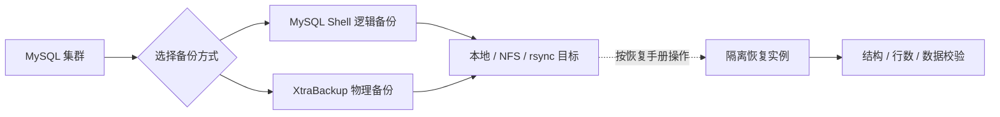

# MySQL InnoDB Cluster 自动化部署

**让 MySQL 高可用从架构方案变成可执行、可维护的日常工作流。**

[](https://github.com/seaworld008/auto-install-mysql-innodb-cluster/actions/workflows/ansible-ci.yml)
[](https://github.com/seaworld008/auto-install-mysql-innodb-cluster/releases/latest)
[](inventory/group_vars/all.yml)
[](collections/requirements.yml)
[](LICENSE)

[English](README_EN.md) · [快速开始](QUICK_START.md) · [部署指南](DEPLOYMENT_COMPLETE_GUIDE.md) · [文档中心](docs/index.md) · [最新版本](https://github.com/seaworld008/auto-install-mysql-innodb-cluster/releases/latest)

面向 DBA、SRE、平台工程和后端团队的 MySQL 集群自动化部署与运维项目。
基于 Ansible 统一编排 **MySQL Server、InnoDB Cluster、MySQL Router、HAProxy 与 Keepalived**，
覆盖首次安装、高可用接入、配置变更、节点扩缩容、状态检查和可选备份。

**一套配置描述环境，一个入口执行操作，从建群持续复用到日常维护。**


*默认高可用拓扑示意：3 台数据库、2 台独立 Router、2 台入口主机。图中展示代表性流量路径，VIP 同一时间由一个入口节点持有，两台 Router 均可按入口策略选择集群后端。*

## 导航

[项目价值](#为什么选择这个项目) · [方案选择](#按场景选择部署方案) · [能力全景](#能力全景) · [架构设计](#架构设计) · [快速开始](#快速开始) · [应用接入](#应用如何连接) · [配置管理](#一套配置管理整个环境) · [日常运维](#部署之后如何运维) · [备份恢复](#备份与恢复) · [本地模拟](#在本机体验完整部署流程) · [文档与贡献](#文档与贡献)

## 为什么选择这个项目

部署一个可持续维护的 MySQL 集群，涉及软件源、数据库参数、成员关系、应用路由、VIP、账号和备份等多个环节。
本项目把这些环节组织成可复用的工作流，让团队在第一次部署之后，仍能用熟悉的配置和命令完成后续操作。

- **把多组件部署串起来**：从主机与参数检查开始，依次安装数据库、配置集群、部署路由与入口，最后检查整体状态。
- **把应用入口与数据库角色分开**：应用通过 VIP 接入，Router 根据集群元数据选择后端，减少应用对固定主节点地址的依赖。
- **把配置变更纳入日常运维**：硬件档位、连接数、超时和入口参数集中管理，修改后按节点应用。
- **把保护措施放进执行流程**：保留 Router 身份与 keyring，检查集群身份和缩容后的节点数量，遇到失败停止后续步骤。
- **把操作方法交给整个团队**：提供中文优先的部署指南、操作手册、变量参考、本地模拟和恢复演练方案，便于交接和二次开发。

### 适合哪些场景

| 使用场景 | 项目提供的帮助 |
| --- | --- |
| 为新业务建立 MySQL 高可用基础设施 | 从空白 Linux 主机开始部署分层集群 |
| 将人工部署步骤标准化 | 用 inventory、统一配置和 Ansible playbook 描述环境 |
| 建立测试、预生产与生产的共同操作方式 | 复用入口与角色，通过各环境的本地配置区分拓扑和凭据 |
| 管理已由本项目部署的集群 | 执行状态检查、配置调整、节点扩缩容和备份 |
| 学习或评估 InnoDB Cluster 架构 | 在隔离模拟环境中观察真实安装与服务管理流程 |

## 按场景选择部署方案

默认架构只是起点：角色可以独立部署，也可以让同一主机承载多个组件；Router 与入口数量由
inventory 决定，并不固定为两台。先选方案，再按对应指南替换参数执行。

| 你希望怎样部署 | 方案与详细步骤 |
| --- | --- |
| 3 MySQL + 2 独立 Router + 2 独立入口 | [七主机独立部署](docs/scenarios/DEDICATED.md) |
| 三台主机，每台共置 MySQL、Router 与入口组件 | [三主机共置部署](docs/scenarios/COLOCATED.md) |
| Router 与数据库共置，HAProxy/Keepalived 独立 | [五主机混合部署](docs/scenarios/MIXED.md) |
| 3 MySQL + 3 Router + 3 HAProxy/Keepalived | [三节点接入层](docs/scenarios/THREE_ENTRY.md) |
| 只部署数据库，或在已有集群上逐层接入 | [组件单独部署](docs/scenarios/COMPONENTS.md) |
| 仅执行内核优化，不安装数据库或入口组件 | [内核专项](docs/scenarios/KERNEL.md) |
| 日常扩缩容、参数变更与备份恢复 | [扩缩容](docs/scenarios/SCALING.md) · [配置变更](docs/scenarios/CONFIGURATION.md) · [备份](docs/scenarios/BACKUPS.md) · [恢复](docs/scenarios/RESTORE.md) |

首次使用从 [公共准备](docs/scenarios/COMMON.md) 开始；完整索引见 [部署方案与操作手册](docs/scenarios/README.md)。
每篇包含适用条件、拓扑或参数、可复制命令、验证、排障与回退说明。

## 能力全景

| 领域 | 已实现能力 | 主要入口 |
| --- | --- | --- |
| 环境准备 | inventory 向导、SSH 配置、前置检查、可选内核优化 | `setup-servers.sh` / `--check-prereq` |
| 数据库安装 | MySQL 8.4 / 8.0 版本线、发行版依赖、数据目录及参数配置 | `--mysql-only` |
| 集群编排 | 创建 InnoDB Cluster、逐台加入成员、组 UUID 与成员状态检查 | `--production-ready` |
| Router 层 | 独立部署、bootstrap、受管配置更新、身份与 keyring 保留 | `--install-routers` |
| 高可用入口 | HAProxy / Keepalived 可分别操作，也可组合部署 | `--install-haproxy` / `--install-keepalived` / `--configure-lb` |
| 应用路由 | 明确 RW、明确 RO、可选自动读写分离三类入口 | VIP `3307` / `3308` / `3309` |
| 配置调整 | 硬件档位切换、配置验证、按节点应用受管配置 | `config_manager.sh` / `--apply-config` |
| MySQL 扩缩容 | 加入新成员、指定新 primary 后移除原写节点、缩容健康校验 | `--scale-mysql-add` / `--scale-mysql-remove` |
| 接入层调整 | 部署新增 Router/LB，按目标缩减并检查最小 HA 数量 | `--install-routers` / `--configure-lb` / `--shrink-router` / `--shrink-lb` |
| 备份 | MySQL Shell 逻辑备份、Percona XtraBackup 物理备份 | `--backup` |
| 状态与排查 | 成员、集群身份、Router/LB 服务、监听端口和 VIP 唯一归属检查 | `--status` |
| 开发与验证 | 本地 Linux 主机模拟、回归测试、Ansible 与文档质量检查 | `tests/lab/` / GitHub Actions |

## 架构设计

### 三层协同，各司其职

| 层级 | 默认组成 | 负责什么 | 为什么这样拆分 |
| --- | --- | --- | --- |
| 入口层 | 2 台 HAProxy + Keepalived | 提供浮动 VIP，转发连接并检测 Router 后端 | 给应用一个稳定接入地址，入口角色可在节点间转移 |
| 路由层 | 2 台独立 MySQL Router | 读取集群元数据，为不同端口选择数据库后端 | 跟随集群角色变化，避免把静态 primary 地址写入 HAProxy |
| 数据层 | 3 台 MySQL | 单主写入、Group Replication、成员选举 | 为复制与多数派决策提供基础拓扑 |

HAProxy 的后端始终指向 Router。MySQL 发生角色变化时，Router 根据集群拓扑选择新的写入后端；
应用通过连接池重连并按业务规则处理事务重试。Keepalived 跟踪入口服务状态，满足故障条件时释放 VIP。

### 控制流程与业务流量分离

Ansible 控制节点通过 SSH 管理目标主机，不参与应用 SQL 请求的转发。
日常业务流量经过 VIP、HAProxy 和 Router 进入数据库；配置与操作则从统一入口执行：



### 内置的操作保护

- **身份保护**：每个集群使用独立 UUID，已有成员与配置不一致时要求核对，不自动更改运行中的组身份。
- **重复执行保护**：识别已有集群成员，Router 默认不强制重新 bootstrap，保留身份与 keyring。
- **变更控制**：配置按节点应用；任一节点失败时中止后续操作，便于定位和处理。
- **缩容约束**：检查剩余节点数量，移除当前 primary 时要求明确指定切主目标。
- **状态检查失败即报错**：成员、服务、端口或 VIP 异常会返回非零退出码，方便接入外部自动化。

SSH 主机身份校验、安装包签名与摘要检查、Vault 凭据传递和备份显式启用贯穿部署流程。
真实环境值保留在本地配置，公开模板便于团队共享和审查。

网络规划、端口与部署组合见 [高可用部署蓝图](docs/reference/DEPLOYMENT_HA_BLUEPRINT_ZH.md)。

## 快速开始

### 1. 准备环境

| 项目 | 要求或默认选择 |
| --- | --- |
| 控制节点 | Python 3.12+、Ansible、SSH 访问能力 |
| 目标节点 | Linux，首次 Ansible 连接前预装 Python 3.9+ |
| 发行版适配 | RHEL 系、Ubuntu、Debian，具体版本与准备项见部署前检查清单 |
| 数据库版本线 | 默认 MySQL 8.4 LTS，可选择 8.0 |
| 完整 HA 拓扑 | 3 台 MySQL、2 台 Router、2 台 HAProxy + Keepalived |
| 主机网络 | 节点之间地址可达，VIP 与网卡配置符合目标网络条件 |

目标发行版、存储和账号准备见 [部署前检查清单](PRE_DEPLOYMENT_CHECKLIST.md)。
暂时没有完整 Linux 环境，可以先使用下文的本地模拟方案。

### 2. 安装控制端依赖

```bash
git clone https://github.com/seaworld008/auto-install-mysql-innodb-cluster.git
cd auto-install-mysql-innodb-cluster

python3 -m venv .venv
source .venv/bin/activate
python -m pip install -r requirements.txt
ansible-galaxy collection install -r collections/requirements.yml
```

### 3. 描述环境，准备凭据

```bash
# 向导默认生成 inventory/hosts.local.yml
./scripts/setup-servers.sh

# 在加密编辑器中填写数据库密码和 VRRP 口令
ansible-vault create inventory/vault.local.yml
```

向导生成的本地 inventory 与 Vault 文件被 Git 忽略。核对节点地址、VIP、网卡和独立组 UUID，
并通过可信渠道确认各主机的 SSH 指纹。Vault 字段示例和逐项说明见 [快速开始](QUICK_START.md)。

### 4. 检查、部署、查看状态

```bash
./scripts/deploy_dedicated_routers.sh --check-prereq \
  -i inventory/hosts.local.yml --ask-vault-pass -e @inventory/vault.local.yml

./scripts/deploy_dedicated_routers.sh --production-ready \
  -i inventory/hosts.local.yml --ask-vault-pass -e @inventory/vault.local.yml

./scripts/deploy_dedicated_routers.sh --status \
  -i inventory/hosts.local.yml --ask-vault-pass -e @inventory/vault.local.yml
```

完整部署按以下阶段组织：


多阶段流程可能多次询问 Vault 口令。自动化运行可使用仓库外、权限受限的
`--vault-password-file`，具体操作见 [完整部署指南](DEPLOYMENT_COMPLETE_GUIDE.md)。

## 应用如何连接

不同工作负载可以选择不同入口，共用同一套集群：

| 访问方式 | VIP 端口 | Router 直连端口 | 适合的工作负载 |
| --- | --- | --- | --- |
| 明确读写 | `3307` | `6446` | 事务写入、DDL、需要访问当前 primary 的请求 |
| 明确只读 | `3308` | `6447` | 报表、查询服务、允许副本延迟的读请求 |
| 自动读写分离 | `3309` | `6450` | 按驱动、连接池和事务行为验证兼容性后采用 |
| HAProxy 状态页 | `8404` | — | 默认仅回环监听，通过 SSH 转发观察 |

例如，通过已配置可信证书的业务域名连接 RW 入口：

```bash
mysql --host=db.example.com --port=3307 --user=app_user --password \
  --ssl-mode=VERIFY_IDENTITY --ssl-ca=/secure/path/organization-ca.pem
```

示例域名、账号和 CA 路径需替换为自己的环境值。应用使用独立的最小权限账号；
事务型业务优先从明确的 RW 入口开始。连接池重连、幂等重试和两段 TLS 的配置要求见
[应用接入指南](docs/runbooks/APPLICATION_CONNECTIONS.md)。

仅 HAProxy 阶段用 `--status --scope haproxy` 检查；启用 Keepalived 后使用默认完整状态门。
分层检查不会安装其他组件，详见 [组件操作](docs/scenarios/COMPONENTS.md)。

## 一套配置管理整个环境

把公共默认值、环境差异和凭据分别管理，方便多人协作与环境复用：

| 配置位置 | 管理内容 |
| --- | --- |
| [`inventory/group_vars/all.yml`](inventory/group_vars/all.yml) | 数据库版本线、硬件档位、连接参数、HA 和备份配置 |
| 本地 `inventory/hosts.local.yml` | 实际主机、角色分组、VIP 和环境覆盖值 |
| 本地 `inventory/vault.local.yml` | 加密数据库密码与 VRRP 口令 |
| [`collections/requirements.yml`](collections/requirements.yml) | Ansible collections 依赖 |

### 按硬件档位组织容量参数

```bash
# 查看可用档位、当前选择和配置完整性
./scripts/config_manager.sh --list
./scripts/config_manager.sh --current
./scripts/config_manager.sh --validate

# 切换档位选择；之后在维护窗口应用配置
./scripts/config_manager.sh --switch optimized_8c32g
```

| 内置档位 | 用途 |
| --- | --- |
| `optimized_8c32g` | 默认的 8 核 32 GiB 数据库参数起点 |
| `original_10k` | 历史高连接配置，供专项容量评估参考 |
| `simulation_minimal` | 低资源隔离功能模拟 |

档位参数集中在 `mysql_config_profiles`，可在同一配置源内新增。
切换档位仅修改选择项，不会立即修改远端服务；容量配置是调优起点，实际规格应结合业务负载评估。
参数含义与覆盖方式见 [变量参考](docs/reference/VARIABLE_REFERENCE.md) 和 [inventory 使用说明](inventory/README.md)。

## 部署之后如何运维

所有操作继续复用部署时的 inventory 和 Vault。以下命令展示一次滚动配置应用：

```bash
./scripts/deploy_dedicated_routers.sh --apply-config \
  -i inventory/hosts.local.yml --ask-vault-pass -e @inventory/vault.local.yml
```

需要执行其他操作时，替换操作参数并提供对应目标：

| 操作 | 参数 | 操作要点 |
| --- | --- | --- |
| 仅部署数据库 | `--mysql-only` | 先完成主机和拓扑准备 |
| 部署 Router | `--install-routers` | 新节点先加入 inventory |
| 只部署 HAProxy | `--install-haproxy` | 要求数据库与 Router 健康，不要求 VIP |
| 只部署 Keepalived | `--install-keepalived` | 要求同机 HAProxy 及上游健康 |
| 部署入口层 | `--configure-lb` | 核对 VIP、网卡及入口节点角色 |
| 滚动配置应用 | `--apply-config` | 安排维护窗口，应用后检查状态 |
| 增加 MySQL 节点 | `--scale-mysql-add --limit mysql-node4` | 先将新节点加入 inventory |
| 移除 MySQL 节点 | `--scale-mysql-remove --target mysql-node3` | 移除当前 primary 时加 `--new-primary` |
| 移除 Router | `--shrink-router --limit router-node3` | 保留最小 HA 节点数量 |
| 移除 LB | `--shrink-lb --limit lb-node3` | 核对剩余入口和 VIP 状态 |
| 执行备份 | `--backup` | 先显式启用并配置备份 |
| 检查状态 | `--status --scope full` | 可选 mysql / router / haproxy，默认 full |
| 内核优化 | `--kernel-optimize-only` | 按目标环境选择执行；容器模拟中跳过 |

`--apply-config` 复用各组件 playbook 收敛配置，可能触发服务重启；它不是 MySQL 版本升级或数据恢复入口。
缩容完成后应同步整理 inventory，再检查完整拓扑。详细步骤见 [操作员指南](docs/runbooks/OPERATOR_GUIDE.md)。

## 备份与恢复

根据数据规模、恢复方式和存储条件选择备份方案，备份功能默认关闭：

| 方式 | 工具 | 配套能力 |
| --- | --- | --- |
| 逻辑备份 | MySQL Shell `util.dumpInstance` | 一致性、并行度、压缩等参数配置 |
| 物理备份 | Percona XtraBackup | 并行备份、可选压缩与 prepare；需要时先解压再 prepare |
| 备份目标 | local / NFS / rsync | 目标路径、保留天数、传输及权限相关配置 |



备份操作与恢复验证分开执行：先得到备份，再在隔离目标验证恢复结果。
项目提供恢复手册与记录模板，覆盖逻辑导入、物理 prepare/copy-back 和数据核验；
不把恢复动作默认指向正在运行的业务集群。

具体配置见 [备份与恢复指南](docs/runbooks/BACKUP_AND_RESTORE_GUIDE.md)。

## 在本机体验完整部署流程

使用 Apple Silicon Mac 时，可以通过 **独立 Lima VM + Rocky Linux x86_64 systemd 容器**准备模拟主机，
继续由原 Ansible 主入口安装数据库、Router 和入口组件。容器承担主机隔离，数据库安装方式与正式流程保持一致。

- VM 资源上限为 6 CPU / 12 GiB，虚拟磁盘按实际写入增长。
- 下载、磁盘、生成配置和数据放在当前仓库被忽略的 `tmp/` 下，适合把仓库放在外置盘。
- 每次初始化生成独立测试凭据，并记录源码版本与完整性摘要。
- 可按方案练习部署、重复执行、配置变更、故障注入、扩缩容和隔离恢复。

准备好方案要求的工具后，可先生成本地工作目录：

```bash
.venv/bin/python tests/lab/lab.py --root "$PWD/tmp/mysql-simulation" --ref HEAD init
```

VM 启动、节点准备、测试顺序、停止和定向清理见 [本地模拟方案](docs/runbooks/LOCAL_SIMULATION.md)。
模拟适合熟悉流程和验证功能；真实主机的内核、安全策略、网络与性能仍需在目标环境确认。

## 技术栈与项目结构

| 组件 | 在项目中的作用 |
| --- | --- |
| Ansible + Collections | 远程配置、分组编排和执行控制 |
| MySQL Server + Shell | 数据库服务、AdminAPI 集群管理和逻辑备份 |
| MySQL Router | 基于元数据的应用路由 |
| HAProxy + Keepalived | 四层入口、后端检测和浮动 VIP |
| Percona XtraBackup | 可选物理备份 |
| Bash + Python | 操作入口、配置管理与本地模拟工具 |
| GitHub Actions | 回归、语法、文档及 Actions 安全检查 |

```text
.
├── inventory/          # 环境模板与唯一运行配置源
├── playbooks/          # 安装、集群编排、变更与健康检查
├── roles/              # MySQL、Router、HAProxy、Keepalived 模板
├── scripts/            # 统一操作入口与辅助工具
├── collections/        # Ansible collections 依赖
├── tests/              # 回归测试与本地模拟工具
├── docs/
│   ├── runbooks/        # 部署、运维、接入与恢复步骤
│   ├── reference/       # 架构、变量和技术参考
│   ├── templates/       # 演练与验证记录模板
│   └── maintainers/     # 维护与发布指南
└── .github/workflows/   # 质量检查与文档站发布
```

## 文档与贡献

| 你的目标 | 推荐阅读 |
| --- | --- |
| 部署第一个集群 | [快速开始](QUICK_START.md) · [部署前检查](PRE_DEPLOYMENT_CHECKLIST.md) |
| 规划架构与资源 | [部署指南](DEPLOYMENT_COMPLETE_GUIDE.md) · [高可用蓝图](docs/reference/DEPLOYMENT_HA_BLUEPRINT_ZH.md) |
| 接入应用 | [连接、事务与 TLS](docs/runbooks/APPLICATION_CONNECTIONS.md) |
| 执行配置调整与扩缩容 | [操作员指南](docs/runbooks/OPERATOR_GUIDE.md) · [变量参考](docs/reference/VARIABLE_REFERENCE.md) |
| 建立备份与恢复流程 | [备份恢复指南](docs/runbooks/BACKUP_AND_RESTORE_GUIDE.md) |
| 排查异常 | [故障排查](docs/runbooks/TROUBLESHOOTING.md) |
| 本地体验与开发 | [模拟环境](docs/runbooks/LOCAL_SIMULATION.md) · [贡献指南](CONTRIBUTING.md) |
| 查看更新与完整文档 | [Changelog](CHANGELOG.md) · [文档中心](docs/index.md) |

欢迎提交可复现的问题、部署反馈和 Pull Request。你可以从完善发行版兼容性、补充应用接入场景、
改进运维体验或丰富文档示例开始参与。开发检查命令和提交约定见 [贡献指南](CONTRIBUTING.md)。

安全问题请按 [安全政策](SECURITY.md) 私下报告。真实主机地址、密码、私钥与 Vault 口令应保存在
受保护的本地配置或外部 Secret 中，不提交到仓库。

如果项目帮助你节省了部署和维护时间，欢迎 Star，也欢迎把可复用的经验贡献回来。

本项目采用 [MIT License](LICENSE)。
