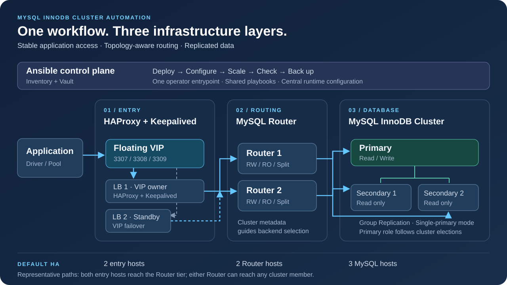

# MySQL InnoDB Cluster Automation

**Deploy and operate MySQL high availability through one Ansible workflow.**

[](https://github.com/seaworld008/auto-install-mysql-innodb-cluster/actions/workflows/ansible-ci.yml)
[](https://github.com/seaworld008/auto-install-mysql-innodb-cluster/releases/latest)
[](LICENSE)

[中文](README.md) · [Quick start](QUICK_START.md) · [Documentation](docs/index.md)

Ansible automation for **MySQL Server, InnoDB Cluster, MySQL Router, HAProxy and Keepalived**.
Built for DBAs, SREs and platform teams that want a shared workflow for installation, scaling,
rolling configuration changes and backups.

## Capabilities

- Deploy a three-member InnoDB Cluster with a dedicated Router layer and a highly available VIP.
- Connect applications through explicit read/write, read-only or optional read/write splitting ports.
- Add and remove MySQL members, shrink Router/LB tiers and apply configuration changes incrementally.
- Check member health, cluster identity, entry services, ports and unique VIP ownership.
- Run opt-in MySQL Shell logical or Percona XtraBackup physical backups; use isolated restore runbooks.
- Prepare local systemd-based Linux hosts for simulation using the same Ansible deployment entrypoint.

## Architecture



*Default HA topology. Paths are illustrative: both Routers select backends from cluster metadata, and the VIP has one owner at a time.*

HAProxy forwards to Router. Router discovers the writable member from cluster metadata.
MySQL defaults to the 8.4 LTS release line; 8.0 is also configurable.

## Why use this project?

- **A connected deployment workflow:** prepare hosts, install MySQL, form the cluster, configure routing and check the complete topology.
- **A stable application entry:** separate the floating VIP from database roles, with Router discovering the current writer.
- **Configuration you can keep using:** shared playbooks and hardware profiles support subsequent changes and scaling.
- **Built-in operating safeguards:** preserve Router identity, check group UUIDs and minimum node counts, and stop on failures.
- **A practical handover:** Chinese-first runbooks, configuration references, restore procedures and local simulation help teams share operating knowledge.

| Layer | Default hosts | Responsibility |
| --- | --- | --- |
| Entry | 2 HAProxy + Keepalived | Floating VIP, TCP forwarding and backend checks |
| Routing | 2 dedicated MySQL Routers | Topology-aware RW, RO and optional split routing |
| Database | 3 MySQL instances | Group Replication with a single primary |

The Ansible control node manages hosts through SSH; it is not in the SQL traffic path.

## Choose a deployment scenario

The default diagram is one layout, not a fixed host count. Inventory can place a canonical host in
multiple role groups or add a third Router and entry node.

| Layout or task | Detailed guide |
| --- | --- |
| 3 MySQL + 2 dedicated Routers + 2 entry hosts | [Dedicated](docs/scenarios/DEDICATED.md) |
| Three hosts sharing database, routing and entry roles | [Colocated](docs/scenarios/COLOCATED.md) |
| Database-side Routers with two dedicated entry hosts | [Mixed](docs/scenarios/MIXED.md) |
| Three Routers and three entry hosts | [Expanded entry tier](docs/scenarios/THREE_ENTRY.md) |
| MySQL, Router, HAProxy or Keepalived separately | [Component operations](docs/scenarios/COMPONENTS.md) |
| Kernel optimization only | [Kernel guide](docs/scenarios/KERNEL.md) |
| Scale, configure, back up and restore | [Scenario index](docs/scenarios/README.md) |

Start with [shared setup](docs/scenarios/COMMON.md). Guides include configuration, commands,
verification and rollback. Keepalived remains on the HAProxy hosts because it checks the local HAProxy service.

## Get started

The control node requires Python 3.12+; managed Linux hosts require Python 3.9+ and SSH access.

```bash
git clone https://github.com/seaworld008/auto-install-mysql-innodb-cluster.git
cd auto-install-mysql-innodb-cluster
python3 -m venv .venv
source .venv/bin/activate
python -m pip install -r requirements.txt
ansible-galaxy collection install -r collections/requirements.yml
./scripts/setup-servers.sh
ansible-vault create inventory/vault.local.yml
```

Configure the generated inventory and encrypted credentials using the [quick start](QUICK_START.md).
Verify host fingerprints through a trusted channel before connecting. Then run:

```bash
./scripts/deploy_dedicated_routers.sh --check-prereq \
  -i inventory/hosts.local.yml --ask-vault-pass -e @inventory/vault.local.yml
./scripts/deploy_dedicated_routers.sh --production-ready \
  -i inventory/hosts.local.yml --ask-vault-pass -e @inventory/vault.local.yml
./scripts/deploy_dedicated_routers.sh --status \
  -i inventory/hosts.local.yml --ask-vault-pass -e @inventory/vault.local.yml
```

Runtime settings live in [`inventory/group_vars/all.yml`](inventory/group_vars/all.yml).
Real addresses and secrets belong in ignored local inventories, Ansible Vault or an external secret manager.

## Connect applications

| Workload | VIP | Direct Router |
| --- | --- | --- |
| Writes, transactions and read-after-write access | `3307` | `6446` |
| Read-only queries that tolerate replica lag | `3308` | `6447` |
| Optional automatic read/write splitting | `3309` | `6450` |

Start transactional applications with the explicit read/write endpoint. Validate driver, pool and
transaction behavior before choosing automatic splitting. See [application connections](docs/runbooks/APPLICATION_CONNECTIONS.md).

## Operate

Use the same entrypoint, inventory and Vault with `--mysql-only`, `--install-routers`,
`--configure-lb`, `--install-haproxy`, `--install-keepalived`, `--apply-config`, `--scale-mysql-add`, `--scale-mysql-remove`,
`--shrink-router`, `--shrink-lb`, `--backup` or `--status`.

Update inventory before adding nodes; explicitly select a new primary when removing the writer.
Backups are disabled by default and support local, NFS and rsync targets.
Existing Router identity and keyring are preserved during configuration convergence.
Plan maintenance windows and validate certificates, capacity, failover and isolated recovery for your environment.

## Configuration and hardware profiles

Runtime defaults, hardware profiles and backup settings live in `inventory/group_vars/all.yml`.
Local inventory describes the environment; Vault or an external secret manager supplies credentials.

```bash
./scripts/config_manager.sh --list
./scripts/config_manager.sh --current
./scripts/config_manager.sh --validate
./scripts/config_manager.sh --switch optimized_8c32g
```

Profiles include `optimized_8c32g`, the historical high-connection `original_10k`, and
`simulation_minimal` for isolated functional tests. Switching a profile changes the local selector;
apply it in a maintenance window through the main operator entrypoint. Size resources for your workload.

## Backup and local simulation

Choose MySQL Shell logical dumps or Percona XtraBackup physical backups, with local, NFS or rsync
storage. Backups are opt-in. Restore into an isolated target and validate schema and data separately;
see the [backup and restore guide](docs/runbooks/BACKUP_AND_RESTORE_GUIDE.md).

On Apple Silicon, the [local simulation](docs/runbooks/LOCAL_SIMULATION.md) uses a dedicated Lima VM
and Rocky Linux x86_64 systemd containers as isolated hosts. The existing Ansible workflow installs
the database and routing services. Generated credentials, downloads and disks stay in ignored local
storage; the VM is capped at 6 CPUs and 12 GiB. This is useful for learning and functional validation.

## Repository map

| Directory | Contents |
| --- | --- |
| `inventory/` | Environment templates and runtime configuration |
| `playbooks/`, `roles/` | Deployment, configuration, scaling and health checks |
| `scripts/` | Operator entrypoint and helpers |
| `tests/` | Regression tests and local host simulation |
| `docs/` | Runbooks, references, drill templates and maintainer guides |
| `.github/workflows/` | Quality checks and documentation publishing |

## Documentation and contributing

- [Deployment guide](DEPLOYMENT_COMPLETE_GUIDE.md) and [pre-deployment checklist](PRE_DEPLOYMENT_CHECKLIST.md)
- [Operator guide](docs/runbooks/OPERATOR_GUIDE.md) and [variable reference](docs/reference/VARIABLE_REFERENCE.md)
- [Backup and restore](docs/runbooks/BACKUP_AND_RESTORE_GUIDE.md)
- [Local simulation](docs/runbooks/LOCAL_SIMULATION.md)
- [Contributing](CONTRIBUTING.md), [security policy](SECURITY.md) and [changelog](CHANGELOG.md)

Documentation is Chinese-first. Reproducible issues, deployment feedback and pull requests are welcome.
Licensed under the [MIT License](LICENSE).

Read-only checks accept `--scope mysql|router|haproxy|full`; full is the default and includes VIP ownership.
