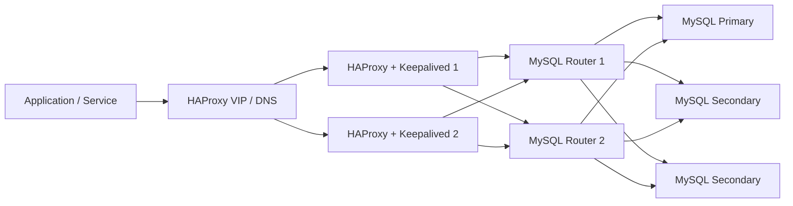
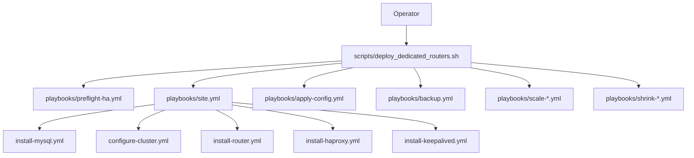

# 架构图与证据留存指南

本文档用于沉淀架构图、部署截图、CLI 运行截图和演练证据。它不替代真实环境验证，也不把截图视为生产就绪证明；截图只是可审计记录的一部分。

## 1. 推荐高可用拓扑



推荐链路：

```text
Application -> HAProxy VIP/DNS -> MySQL Router cluster -> MySQL InnoDB Cluster
```

## 2. 运维入口图



约束：

- 运行时配置只从 `inventory/group_vars/all.yml` 出发。
- 操作入口优先走 `scripts/deploy_dedicated_routers.sh`。
- `deploy.sh` 只是兼容包装层。

## 3. 端口视图

| 层级 | 端口 | 类型 | 用途 |
| --- | --- | --- | --- |
| HAProxy VIP | `3309` | 自动读写分离 | 推荐应用默认入口 |
| HAProxy VIP | `3307` | 强制读写 | DDL、写入任务、运维写入口 |
| HAProxy VIP | `3308` | 强制只读 | 报表、查询、只读任务 |
| MySQL Router | `6450` | 自动读写分离 | 绕过 HAProxy 直连 Router |
| MySQL Router | `6446` | 强制读写 | 运维直连或应急入口 |
| MySQL Router | `6447` | 强制只读 | 只读排查或分析 |
| HAProxy stats | `8404` | 监控 | HAProxy stats 页面 |

## 4. 建议截图与证据清单

| 证据类型 | 建议文件名 | 来源 | 脱敏要求 |
| --- | --- | --- | --- |
| 前置检查输出 | `preflight-ha-YYYYMMDD.png` | 终端截图或 CI log | 隐藏内网敏感 IP、账号 |
| 完整部署输出 | `production-ready-YYYYMMDD.png` | 终端截图 | 隐藏密码、Token、私有域名 |
| 状态检查输出 | `status-YYYYMMDD.png` | `--status` 输出 | 隐藏真实业务库名 |
| HAProxy stats | `haproxy-stats-YYYYMMDD.png` | Web 截图 | 隐藏真实后端公网信息 |
| Router / MySQL 端口验证 | `ports-YYYYMMDD.png` | CLI 输出 | 隐藏业务账号 |
| 备份完成记录 | `backup-YYYYMMDD.png` | CLI 输出或备份 manifest | 隐藏远端备份地址 |
| 恢复演练记录 | `restore-drill-YYYYMMDD.md` | 模板记录 | 不提交真实数据样本 |

建议把截图放入：

```text
docs/assets/screenshots/
```

如仓库公开发布，优先提交脱敏后的 Markdown 演练记录，而不是包含内网信息的原始截图。

## 5. CLI 证据采集建议

```bash
./scripts/deploy_dedicated_routers.sh --check-prereq -i inventory/hosts-with-dedicated-routers.yml
./scripts/deploy_dedicated_routers.sh --production-ready -i inventory/hosts-with-dedicated-routers.yml
./scripts/deploy_dedicated_routers.sh --status -i inventory/hosts-with-dedicated-routers.yml
./scripts/health-check-ha.sh inventory/hosts-with-dedicated-routers.yml
```

记录时至少保留：

- 命令
- 执行时间
- inventory 名称
- 目标环境名称
- 结果摘要
- 失败项和后续动作

## 6. 证据边界

可以准确表述：

- 静态验证已通过
- Ansible syntax check 已通过
- inventory 解析已通过
- staging 环境部署已完成
- 某次故障演练在指定环境和指定日期通过

不应仅凭截图声称：

- 已证明生产完全可用
- 已证明所有故障都能自动恢复
- 已证明备份可恢复，除非实际执行过恢复演练
- 已证明性能或 SLA，除非有压测与观测数据
