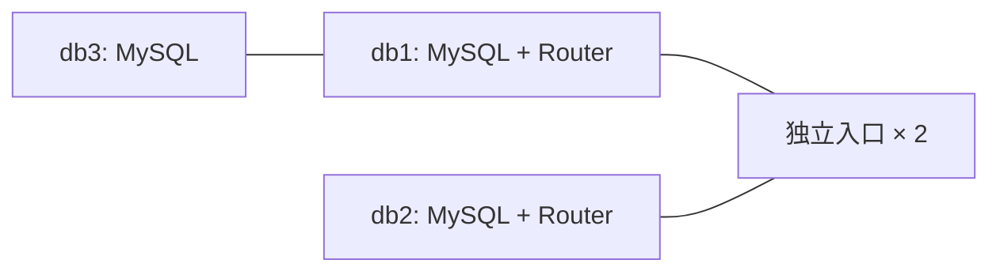

# 混合部署：数据库侧 Router + 独立入口

## 适用条件与架构

希望节省 Router 专用主机，同时保留独立入口。db1/db2 运行 Router，db3 只承担数据库角色。 需要 5 台目标主机，另备 Ansible 控制端。



db1/db2 同时加入 mysql_cluster 和 mysql_router，lb1/lb2 单独加入 haproxy_lb。

## 配置

完成 [公共准备](COMMON.md)，其中选择 `TOPOLOGY=mixed`。
模板可直接查看：[角色与主机定义](https://github.com/seaworld008/auto-install-mysql-innodb-cluster/blob/main/examples/topologies/mixed.yml)。
替换文档地址，填写独立组 UUID、真实 VIP、网卡和 Vault 凭据，定义 `DEPLOY`、`COMMON_ARGS`。

共置时按整台主机规划 CPU、内存、磁盘与连接数，各组件资源不会被 inventory 自动隔离。
独立部署也需自行确认机架、网络、存储等故障域，主机数量本身不等于容灾等级。

## 执行

```bash
"$DEPLOY" --check-prereq "${COMMON_ARGS[@]}"
"$DEPLOY" --production-ready "${COMMON_ARGS[@]}"
"$DEPLOY" --status "${COMMON_ARGS[@]}"
```

如本次不修改内核参数，在部署命令追加 `--skip-kernel-optimization`；如需先单独处理内核，
按 [内核专项](KERNEL.md) 执行。也可以按 [组件操作](COMPONENTS.md) 逐层安装。

## 验证

- `--status` 退出码为 0，所有数据库成员 ONLINE 且组 UUID 一致。
- 各 Router 的 RW/RO/Split 端口监听，HAProxy 后端包括 inventory 中的全部 Router。
- 所有入口服务正常，VIP 恰好归属一台入口主机。
- 按 [应用接入](../runbooks/APPLICATION_CONNECTIONS.md) 测试 RW 写入和只读访问。

```bash
# 查看角色分组，不输出变量或密码
ansible-inventory "${COMMON_ARGS[@]}" --graph
# 在入口节点查看后端声明；这只是配置观察，不能代替整体健康检查
ansible haproxy_lb "${COMMON_ARGS[@]}" -b -m command -a "grep server /etc/haproxy/haproxy.cfg"
```

## 排障与回退

- 端口冲突：检查各层监听端口，共置方案尤其不能将 HAProxy 前端改成 MySQL 3306。
- VIP 不唯一：检查 VRRP 网络、网卡、VIP 冲突和优先级；三节点优先级应显式区分。
- 节点故障：恢复失败组件后重新执行状态检查；连接中断后的事务按业务幂等规则处理。
- 新装环境不再需要入口时，可用下列显式操作停止整个入口层；不会删除数据库，但应用会断连。

```bash
"$DEPLOY" --rollback "${COMMON_ARGS[@]}"
```

该命令会停止 Router、HAProxy 和 Keepalived，不是软件降级或数据恢复。
已有生产环境变更应先保留配置与可恢复备份；回退按 [操作员指南](../runbooks/OPERATOR_GUIDE.md) 执行。
后续增减节点见 [扩缩容方案](SCALING.md)。
